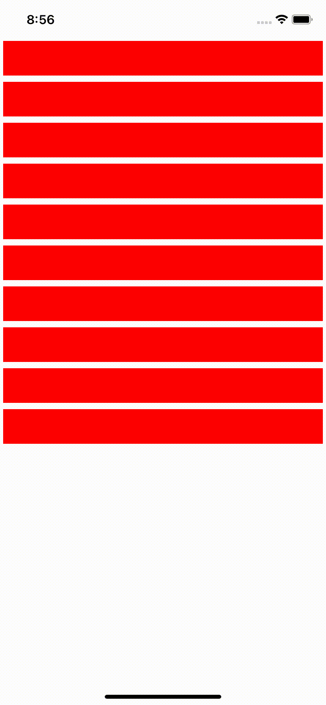

# react-native-ly-refresh-control

下拉刷新

iOS 基于MJRefresh 通过RCTCustomRefreshContolProtocol实现RefreshControl组件封装
JS端可以无侵入自定义下拉刷新只需要替换对应的refreshControl

Android 未完成

## Installation

```sh
yarn react-native-ly-refresh-control
```

## Usage

```js
import LYRefreshControl from "react-native-ly-refresh-control";

<ScrollView
  style={styles.scroll}
  refreshControl={
    <LYRefreshControl
      refreshing={refreshing}
      onRefresh={onRefresh}
      idleSources={[
        require('./assets/dropdown_anim__0001.png'),
        require('./assets/dropdown_anim__0002.png'),
        require('./assets/dropdown_anim__0003.png'),
        require('./assets/dropdown_anim__00020.png'),
        require('./assets/dropdown_anim__00021.png'),
        require('./assets/dropdown_anim__00030.png'),
        require('./assets/dropdown_anim__00031.png'),
      ]}
      refreshingSources={[
        require('./assets/dropdown_loading_01.png'),
        require('./assets/dropdown_loading_02.png'),
        require('./assets/dropdown_loading_03.png'),
      ]}
    />
  }
>
  ...
</ScrollView>


```

## Live



## TODO

* [ ] iOS 更多属性控制
* [ ] android 基于 SmartRefreshLayout 实现

## License

MIT
